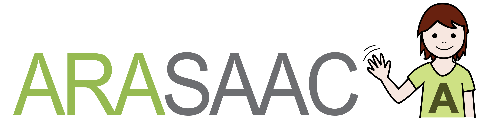

# ArasaacBot

## Overview
Telegram Bot that interact with Araasac Web API. Professionals and persons with language or communication disorders could use to search and use pictograms in an easy and fast way.

## Commands.

Lists of commands you can use:

### picsColor

```/picsColor <word>```

### picsBW

```/picsBW <word>```

### translate

  ```/translate <text to translate>```


## Inline Mode

```@arasaacbot <word>```


## Credits
This software is property of Sergio Sánchez Trujillo (@trukise) and logopedaSUR (http://www.logopedasur.es).

Pictograms that use ArasaacBot are property of Aragón Governament, and had been development by Sergio Palao for ARASAAC (http://arasaac.org) that distribute them by Creative Commons License (BY-NC-SA)

---

Los pictogramas que utiliza ArasaacBot son propiedad del Gobierno
de Aragón y ha sido desarrollados por Sergio Palao para ARASAAC (http://arasaac.org)
que los distribuye bajo licencia Creative Commons (BY-NC-SA)
