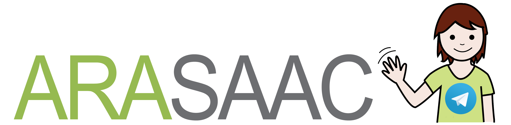

# ArasaacBot

Telegram Bot that interact with Araasac Web API. Professionals and persons with language or communication disorders could use to search and use pictograms in an easy and fast way.


## Getting Started.

The next steps give you instructions to get a copy of AraasacBot project up and runnning in your local machine.

### Prerequisites
To run the bot properly you need a **key of Araasac API**. To get this key, you have to ask Araasac Team, and talk about your project, after that the give you an answer about it, accepting or denying.

Other requirements:
* Python 3.5.0+
* Pillow 3.1.2+

### Installing

1. Clone the repository

        git clone https://github.com/truki/ArasaacBot.git

2. Copy Araasac API key in *.arasaacAPIKey* file.
3. Copy your Telegram API Key in *.telegramApiKey* file
4. Write the correct configuration to access Internet on *proxi.ini* file.

        [proxy_settings]
        proxy = yes | no
        url = http|https://<ip proxy>
        port = <port>

5. Run the script:

        $./arasaacbot

### Using the boot - Commands -

#### picsColor

```/picsColor <word>```

#### picsBW

```/picsBW <word>```

#### pics

```/pics <word>```

Command that run a "wizard" where the user can contruct the query to search the word introduced guidely, pressing the buttons that will be appearing

#### translate

  ```/translate <text to translate>```

  Command that translate to pictograms (if its possible) a phrase introduced like arguments.
  Please don't insert putuation, question or exclamation symbols.

#### Other commands

* **start**

  All Telegram's bot has one, show a brief information to begin with the bot.

  ```/start```

* **help**

  Yes, could help you... :)

  ```/help```

* **About**

    Some things about the bot and our team.

  ```/About```

* **Restart**

  Restart de boot (only for admin user).

  ```/restart```

#### Inline Mode

```@arasaacbot <word>```

Inline command that previsualize a list of pictograms depending the argument passed.

## Authors

* Sergio Sánchez Trujillo - Developer - @trukise
* Maria Dolores Carrero Díaz-Flores - Speech therapist - @logopedaSUR

## License
This software is property of logopedaSUR (http://www.logopedasur.es) and had been development by Sergio Sánchez Trujillo for logopedaSUR and Araasac (http://arasaac.org)

<a rel="license" href="http://creativecommons.org/licenses/by-nc-sa/4.0/"></a><br />This work is under <a rel="license" href="http://creativecommons.org/licenses/by-nc-sa/4.0/">licencia de Creative Commons License (BY-NC-SA)</a>.

Pictograms that use ArasaacBot are property of Aragón Governament, and had been development by Sergio Palao for ARASAAC (http://arasaac.org) that distribute them by Creative Commons License (BY-NC-SA)

---

Los pictogramas que utiliza ArasaacBot son propiedad del Gobierno
de Aragón y ha sido desarrollados por Sergio Palao para ARASAAC (http://arasaac.org)
que los distribuye bajo licencia Creative Commons (BY-NC-SA)

## Acknowledgments
Thanks to Lola Carrero for her colaboration and to Araasac Team for approve my project and help/answer me ever and fastly.
